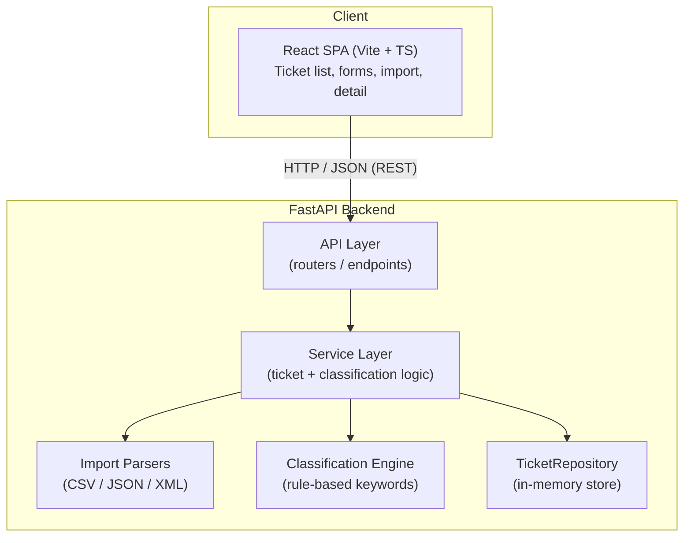

# Intelligent Customer Support System

> **Student Name**: Oleksandr Ponomarenko
> **Date Submitted**: 2026-07-04
> **AI Tools Used**: Claude Code — used throughout planning, implementation,
> testing, and documentation. See [docs/PLAN.md](docs/PLAN.md) and
> [docs/ARCHITECTURE.md](docs/ARCHITECTURE.md) §10 for the phase-by-phase log.

A full-stack ticket management system for support teams: import tickets from CSV,
JSON, or XML, have them auto-classified by category and priority, and manage them
through a React web UI.

Built for Homework 2 of the AI-Assisted Software Engineering course. See
[TASKS.md](TASKS.md) for the assignment spec.

---

## Features

- **Import** tickets in bulk from **CSV, JSON, or XML** — malformed rows are reported
  per-record instead of failing the whole file.
- **Auto-classification**: a deterministic, rule-based keyword engine assigns
  `category` and `priority`, with a confidence score, human-readable reasoning, and
  the matched keywords. No external LLM calls — offline and fully testable.
- **Manual override**: agents can edit category/priority directly; the system marks
  the classification as manually overridden.
- **Full ticket CRUD** with filtering by category, priority, and status.
- **React SPA** — ticket list, create/edit forms, detail view, and a bulk-import
  widget, all driven by the REST API (no hardcoded data).
- **>85% test coverage** with unit, integration, and performance tests.

---

## Architecture at a glance



- **Backend**: Python + FastAPI, Pydantic v2 for validation, in-memory repository
  (data resets on restart — a deliberate scope trade-off for this assignment).
- **Frontend**: React + Vite + TypeScript, talking to the backend exclusively over
  the REST API.
- **Classification**: deterministic keyword matching, not a trained model — see
  [`src/backend/app/classification`](src/backend/app/classification).

Full design rationale, data model, and sequence diagrams live in
[docs/ARCHITECTURE.md](docs/ARCHITECTURE.md). Every endpoint's request/response
shape is documented in [docs/API_REFERENCE.md](docs/API_REFERENCE.md).

---

## Project structure

```
homework-2/
├── docs/                   # Architecture, API reference, testing guide, plan
├── sample_data/            # Sample CSV/JSON/XML tickets + invalid files for testing
├── docker-compose.yml      # One-command local run (backend + frontend)
└── src/
    ├── backend/            # FastAPI app
    │   └── app/
    │       ├── main.py           # App entrypoint + router registration
    │       ├── api/               # HTTP routers (tickets, health)
    │       ├── models/            # Pydantic models + enums
    │       ├── services/          # Ticket / Import / Classification business logic
    │       ├── parsers/           # CSV / JSON / XML parsers
    │       ├── classification/    # Rule-based keyword engine
    │       ├── repository/        # Repository interface + in-memory implementation
    │       └── core/              # Config, error handlers
    ├── frontend/           # React + Vite + TypeScript SPA
    │   └── src/
    │       ├── api/                # Typed fetch client
    │       ├── hooks/               # Data-fetching hooks
    │       ├── components/          # Reusable UI (list, form, detail, import, toast)
    │       └── types/                # Shared TS types
    └── tests/              # Pytest suite (unit, integration, performance)
```

---

## Getting started

### Prerequisites

- Python 3.11+
- Node.js 18+
- Docker + Docker Compose (optional, for the one-command run)

### Option A: Docker Compose (easiest)

```bash
docker-compose up
```

- Backend: http://localhost:8000 (interactive API docs at `/docs`)
- Frontend: http://localhost:5173

### Option B: Run backend and frontend locally

**Backend**

```bash
cd src/backend
python -m venv .venv && source .venv/bin/activate
pip install -r requirements.txt
cp .env.example .env
uvicorn app.main:app --reload
```

The API is now at http://localhost:8000, with interactive docs at
http://localhost:8000/docs.

**Frontend** (in a separate terminal)

```bash
cd src/frontend
npm install
cp .env.example .env
npm run dev
```

The app is now at http://localhost:5173.

### Try it out

- Import sample data: use the **Bulk Import** page in the UI, or `curl`, pointing at
  the files in [`sample_data/`](sample_data) (50 CSV, 20 JSON, 30 XML tickets, plus
  `sample_data/invalid/` for testing error handling).
- Create a ticket via the UI or `POST /tickets`, then click **Auto-classify** (or
  call `POST /tickets/{id}/auto-classify`) to see category, priority, confidence,
  and reasoning.
- Full request/response examples for every endpoint: [docs/API_REFERENCE.md](docs/API_REFERENCE.md).

---

## Running tests

From `src/backend` (tests live in `src/tests`, run against the `app` package):

```bash
cd src/backend
pytest --cov=app --cov-report=term-missing --cov-fail-under=85
```

This runs the full suite — unit tests for models, parsers, and the classification
engine, plus integration and performance tests — and fails the build if coverage
drops below 85%. See [docs/TESTING_GUIDE.md](docs/TESTING_GUIDE.md) for the test
pyramid, fixture locations, and a manual verification checklist.

Frontend lint:

```bash
cd src/frontend
npm run lint
```

---

## Documentation

| Doc | Audience | Contents |
|---|---|---|
| [docs/ARCHITECTURE.md](docs/ARCHITECTURE.md) | Technical leads / architects | Design decisions, component breakdown, data model, sequence diagrams |
| [docs/API_REFERENCE.md](docs/API_REFERENCE.md) | API consumers | Every endpoint with request/response examples, schemas, error formats |
| [docs/TESTING_GUIDE.md](docs/TESTING_GUIDE.md) | QA / contributors | Test pyramid, how to run tests, fixtures, benchmark numbers |
| [docs/PLAN.md](docs/PLAN.md) | Project history | Phased implementation plan and progress tracker |

---

<div align="center">

*This project was completed as part of the AI-Assisted Development course.*

</div>
