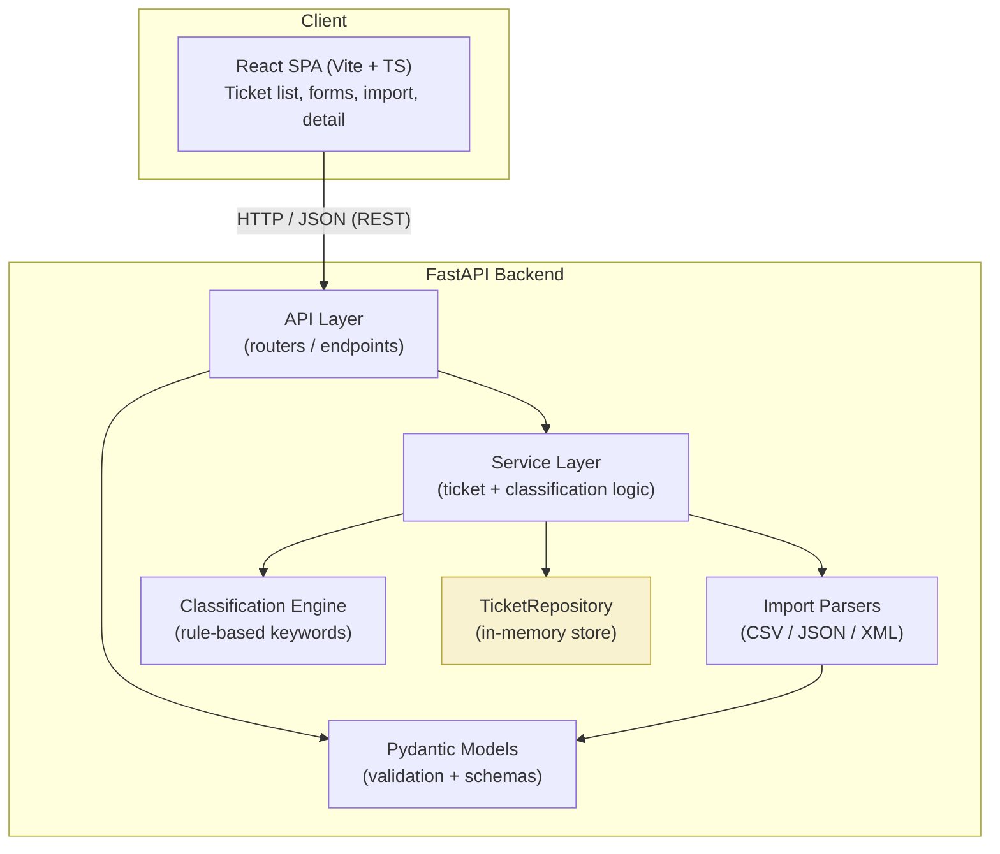
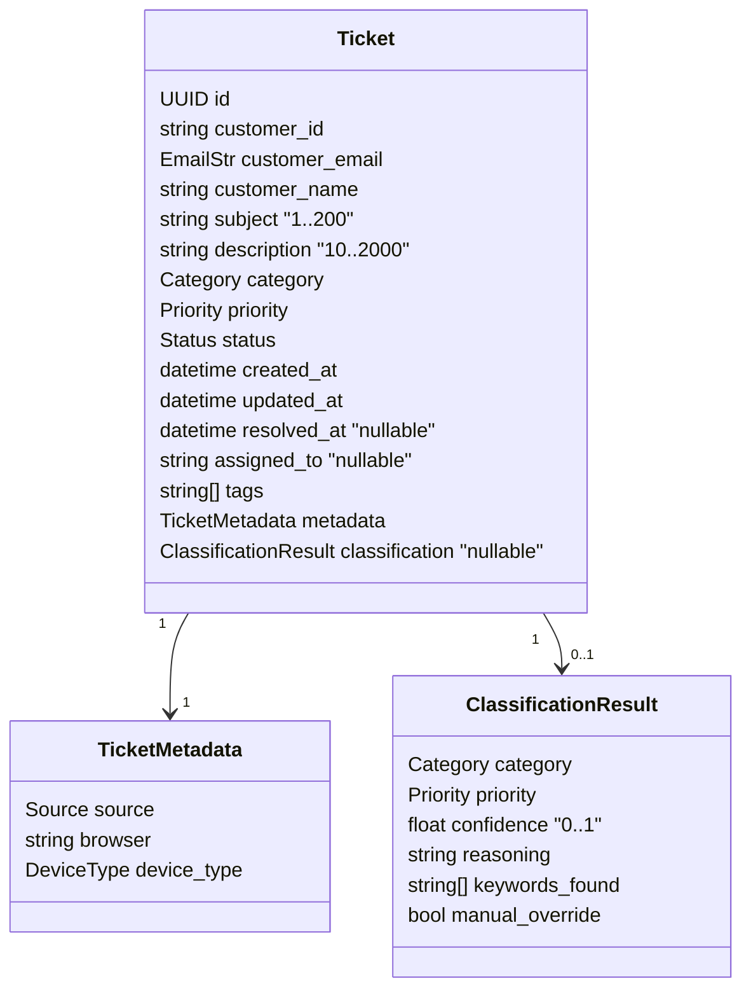
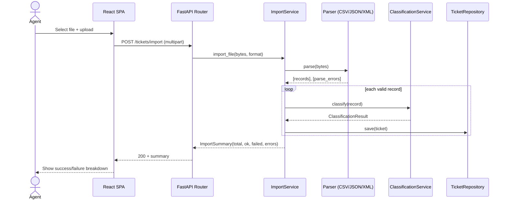
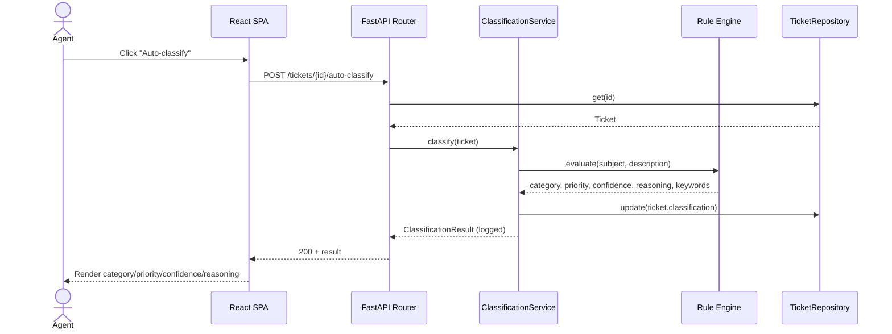

# 🏗️ Architecture — Intelligent Customer Support System

> **Audience:** Technical Leads / Architects
> **Status:** Living document — kept in sync with the implementation at all times.
> **Last updated:** 2026-07-04

---

## 1. Overview

The Intelligent Customer Support System is a full-stack web application that lets
support agents import, triage, and manage customer tickets. It exposes a REST API
(built with **Python / FastAPI**) that:

- Accepts tickets one-by-one or in bulk from **CSV, JSON, and XML** files.
- **Auto-classifies** each ticket (category + priority) using a deterministic,
  rule-based keyword engine that returns a confidence score, human-readable
  reasoning, and the matched keywords.
- Serves a **React** single-page front-end that agents use day-to-day.

### Key architectural decisions (locked)

| Decision | Choice | Rationale |
|----------|--------|-----------|
| Backend framework | **FastAPI** | Async, first-class Pydantic validation, auto OpenAPI docs. |
| Frontend framework | **React (Vite + TypeScript)** | Fast dev loop, component model, wide familiarity. |
| Persistence | **In-memory repository** | Zero external setup; simplest for a homework. Repository interface allows a future DB swap without touching the service layer. |
| Classification | **Rule-based keyword engine** | Deterministic, offline, free, and fully unit-testable for >85% coverage. Produces the `keywords found` + `reasoning` fields the spec requires. |
| Delivery | **Local dev + docker-compose** | `uvicorn` + `vite` for development; one `docker-compose up` for reviewers. |

> ⚠️ **Persistence trade-off:** the in-memory store loses all data on restart. This
> is acceptable for the assignment and for demos. All data access goes through a
> `TicketRepository` abstraction so a SQLite/Postgres implementation can replace it
> later with no changes to the service or API layers.

---

## 2. High-Level Architecture



---

## 3. Component Descriptions

### 3.1 Frontend (`src/frontend`)
A React + TypeScript SPA built with Vite. Talks to the backend exclusively over the
REST API (no hardcoded ticket data). Responsibilities:

- **Ticket List** with combined filtering (category, priority, status).
- **Create / Edit** forms with client-side validation mirroring the API rules.
- **Ticket Detail** view showing classification results and metadata.
- **Bulk Import** widget for CSV/JSON/XML with a per-file import summary.
- **Auto-classify** action that displays category, priority, confidence, reasoning.
- **Feedback**: toast/inline messages for success and error states.

Layered structure: `api/` (typed fetch client) → `hooks/` (data fetching/state) →
`components/` + `pages/` (presentation). Responsive layout for desktop and mobile.

### 3.2 API Layer (`src/backend/app/api`)
FastAPI routers that map HTTP endpoints to service calls, handle request/response
schemas, and translate domain errors into correct HTTP status codes (201/200/400/
404/422). Auto-generates OpenAPI docs at `/docs`.

### 3.3 Service Layer (`src/backend/app/services`)
Framework-agnostic business logic:
- `TicketService` — CRUD, filtering, and orchestration of import + classification.
- `ImportService` — dispatches a file to the correct parser and aggregates the
  bulk-import summary (total / successful / failed + per-row error detail).
- `ClassificationService` — wraps the classification engine and records decision logs.

### 3.4 Import Parsers (`src/backend/app/parsers`)
One parser per format (`csv`, `json`, `xml`) behind a common interface. Each parser
converts raw file bytes into a list of candidate ticket dicts and reports per-record
parse errors without aborting the whole batch. Malformed files yield meaningful,
structured error messages rather than 500s.

### 3.5 Classification Engine (`src/backend/app/classification`)
Deterministic rule-based engine:
- **Category** — keyword sets per category (`account_access`, `technical_issue`,
  `billing_question`, `feature_request`, `bug_report`, `other`).
- **Priority** — keyword rules from the spec: urgent (`can't access`, `critical`,
  `production down`, `security`), high (`important`, `blocking`, `asap`), low
  (`minor`, `cosmetic`, `suggestion`), medium as default.
- Returns `category`, `priority`, `confidence` (0–1, derived from match strength),
  `reasoning` (string), and `keywords_found` (list). Supports manual override and
  logs every decision.

### 3.6 Repository (`src/backend/app/repository`)
`TicketRepository` interface with an `InMemoryTicketRepository` implementation
(thread-safe dict keyed by UUID). Single seam for future DB persistence.

### 3.7 Models (`src/backend/app/models`)
Pydantic v2 models: `Ticket`, `TicketCreate`, `TicketUpdate`, `TicketMetadata`,
enums (`Category`, `Priority`, `Status`, `Source`, `DeviceType`),
`ClassificationResult`, and `ImportSummary`. Central point for field validation
(email format, subject 1–200, description 10–2000, enum membership).

---

## 4. Data Model



**Enums**
- `Category`: account_access | technical_issue | billing_question | feature_request | bug_report | other
- `Priority`: urgent | high | medium | low
- `Status`: new | in_progress | waiting_customer | resolved | closed
- `Source`: web_form | email | api | chat | phone
- `DeviceType`: desktop | mobile | tablet

---

## 5. API Surface

| Method | Endpoint | Description | Success |
|--------|----------|-------------|---------|
| POST | `/tickets` | Create ticket (optional `?auto_classify=true`) | 201 |
| POST | `/tickets/import` | Bulk import CSV/JSON/XML (multipart upload) | 200 |
| GET | `/tickets` | List with filters (`category`, `priority`, `status`) | 200 |
| GET | `/tickets/{id}` | Get one ticket | 200 |
| PUT | `/tickets/{id}` | Update ticket | 200 |
| DELETE | `/tickets/{id}` | Delete ticket | 204 |
| POST | `/tickets/{id}/auto-classify` | Classify + return result | 200 |
| GET | `/health` | Liveness probe | 200 |

Validation failures return **422** (Pydantic) or **400** (semantic), missing
resources **404**. Full request/response examples live in `docs/API_REFERENCE.md`.

---

## 6. Data Flow

### 6.1 Bulk import with auto-classification



### 6.2 Single-ticket auto-classify



---

## 7. Project Structure

```
homework-2/
├── CLAUDE.md                  # Guidance for AI coding sessions
├── README.md                  # Developer docs (Task 4.1)
├── docker-compose.yml         # One-command local run
├── docs/
│   ├── ARCHITECTURE.md        # This file (Task 4.3)
│   ├── API_REFERENCE.md       # Task 4.2
│   ├── TESTING_GUIDE.md       # Task 4.4
│   ├── PLAN.md                # Implementation plan
│   └── screenshots/
│       ├── test_coverage.png
│       └── ui.png
├── sample_data/
│   ├── sample_tickets.csv     # 50 tickets
│   ├── sample_tickets.json    # 20 tickets
│   ├── sample_tickets.xml     # 30 tickets
│   └── invalid/               # Negative-test files
├── src/
│   ├── backend/
│   │   ├── app/
│   │   │   ├── main.py            # FastAPI app + router registration
│   │   │   ├── api/               # Routers (tickets, health)
│   │   │   ├── models/            # Pydantic models + enums
│   │   │   ├── services/          # Ticket / Import / Classification services
│   │   │   ├── parsers/           # csv / json / xml parsers
│   │   │   ├── classification/    # Rule engine + keyword config
│   │   │   ├── repository/        # Repository interface + in-memory impl
│   │   │   └── core/              # Config, logging, error handlers
│   │   ├── pyproject.toml / requirements.txt
│   │   └── Dockerfile
│   ├── frontend/
│   │   ├── src/
│   │   │   ├── api/               # Typed API client
│   │   │   ├── hooks/             # Data hooks
│   │   │   ├── components/        # Reusable UI
│   │   │   ├── pages/             # List / Detail / Create-Edit / Import
│   │   │   └── types/            # Shared TS types
│   │   ├── package.json / vite.config.ts
│   │   └── Dockerfile
│   └── tests/                    # Pytest suite (Task 3 & 6)
│       ├── test_ticket_api.py
│       ├── test_ticket_model.py
│       ├── test_import_csv.py
│       ├── test_import_json.py
│       ├── test_import_xml.py
│       ├── test_categorization.py
│       ├── test_integration.py
│       ├── test_performance.py
│       └── fixtures/
```

---

## 8. Security Considerations

- **Input validation** at the edge via Pydantic (lengths, email format, enums);
  rejects oversized/unknown fields.
- **Upload safety**: enforce file-size limits and validate declared vs. actual
  format; parsers never `eval`/execute file content.
- **XML parsing hardening**: use `defusedxml` to prevent XXE / billion-laughs
  attacks (do not use the stdlib parser on untrusted input).
- **CORS**: restricted to the known frontend origin in config.
- **No secrets in code**: configuration via environment variables.
- Out of scope for this assignment: authN/authZ, rate limiting (noted as future work).

---

## 9. Performance Considerations

- In-memory dict gives O(1) lookups by id; filtering is O(n) over the set, which is
  fine for assignment-scale data.
- Async FastAPI handlers keep the event loop free during I/O.
- Bulk import processes records in a single pass and streams per-row errors instead
  of failing the whole batch.
- **Concurrency**: repository writes are guarded so 20+ simultaneous requests
  (Task 6) remain consistent.
- Performance tests (Task 6) assert latency/throughput budgets, documented as a
  benchmark table in `docs/TESTING_GUIDE.md`.

---

## 10. Change Log

| Date | Change |
|------|--------|
| 2026-07-04 | Initial architecture. Decisions locked: in-memory store, rule-based classification, local dev + docker-compose. |
| 2026-07-04 | Phases 1–6 implemented: backend scaffolding, models/repository, CRUD API, CSV/JSON/XML import, rule-based classification engine, and sample/fixture data. Frontend is still a bare Vite skeleton (Phase 7 not started). |
| 2026-07-04 | Phase 7 complete: full React SPA with typed API client, hooks, components for list/create/edit/detail, bulk import widget, auto-classify action, toast notifications, and responsive layout. All pages functional and API-driven. |
