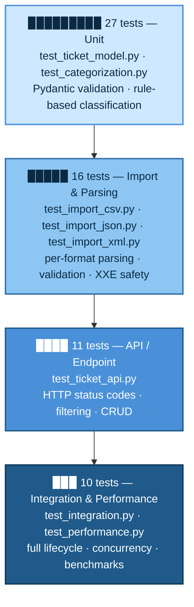

# 🧪 Testing Guide — Intelligent Customer Support System

> **Audience:** QA Engineers
> **Status:** Living document — kept in sync with `src/tests/`.
> **Last updated:** 2026-07-04
> **Generated by:** Claude Code (Sonnet 5) — see [README.md](../README.md) header
> and [PLAN.md](PLAN.md) Phase 10 for the doc-per-model log.

This guide is for QA engineers who need to run, extend, or manually verify the test
suite for the ticket import & classification system. It assumes no prior context on
the codebase — just a working Python 3.11+ / Node 18+ environment.

---

## 1. Test Pyramid

The suite has 64 automated tests across 8 files, layered from fast/isolated unit
tests up to slower end-to-end and performance checks.



Bars are proportional to test count (1 block ≈ 3 tests) — more tests, wider bar, cheaper
and faster to run; the color darkens toward the top as tests get slower and more
expensive (real HTTP client, concurrency, timing).

**Why this shape:** most coverage sits in fast unit and parsing tests (43 tests, no
network or file I/O beyond in-memory fixtures), with a thinner layer of API tests
against a real `TestClient`, and the smallest layer reserved for expensive
end-to-end/concurrency/performance scenarios — the classic pyramid, not an
hourglass or ice-cream cone.

---

## 2. How to Run the Tests

All commands run from `src/backend` (the `pyproject.toml` there points
`testpaths` at `../tests`).

### 2.1 One-time setup

```bash
cd src/backend
python -m venv .venv
source .venv/bin/activate        # Windows: .venv\Scripts\activate
pip install -r requirements.txt
```

### 2.2 Run the full suite

```bash
pytest
```

### 2.3 Run with coverage (the required gate)

```bash
pytest --cov=app --cov-report=term-missing --cov-fail-under=85
```

- Fails the run (non-zero exit code) if line+branch coverage drops below **85%**.
- Current measured coverage: **94.77%** (64 passed). See
  `docs/screenshots/test_coverage.png` for the captured report.

### 2.4 Useful variants

| Goal | Command |
|------|---------|
| Run one file | `pytest test_import_csv.py` |
| Run one test | `pytest test_import_csv.py::test_valid_csv_all_successful` |
| Run by keyword | `pytest -k "xxe or malformed"` |
| Stop on first failure | `pytest -x` |
| Verbose test names | `pytest -v` |
| HTML coverage report | `pytest --cov=app --cov-report=html` then open `htmlcov/index.html` |

### 2.5 Run the whole stack for manual/exploratory testing

```bash
docker-compose up
```

- Backend: http://localhost:8000 (docs at `/docs`)
- Frontend: http://localhost:5173

Or locally without Docker:

```bash
# terminal 1
cd src/backend && uvicorn app.main:app --reload
# terminal 2
cd src/frontend && npm install && npm run dev
```

---

## 3. Test Suite Overview

| File | Tests | Layer | What it covers |
|------|:-:|-------|-----------------|
| `test_ticket_model.py` | 9 | Unit | Pydantic validation: field lengths, email/enum rejection, defaults |
| `test_categorization.py` | 18 | Unit | Rule-based classification: all 6 categories, 4 priority tiers, confidence/reasoning/keywords, override preserved (11 test functions, some parametrized into multiple cases) |
| `test_import_csv.py` | 6 | Import | Valid/mixed/malformed/empty CSV, missing columns, auto-classify on import |
| `test_import_json.py` | 5 | Import | Valid/invalid JSON, wrong shape, per-record errors, empty array |
| `test_import_xml.py` | 5 | Import | Valid/malformed XML, per-record errors, **XXE neutralization**, empty document |
| `test_ticket_api.py` | 11 | API | Full CRUD, `auto_classify` query flag, filtering by category/priority/status, 404s, 422s |
| `test_integration.py` | 5 | E2E | Full lifecycle, bulk import + classify, 20+ concurrent requests, combined filters, manual-override persistence |
| `test_performance.py` | 5 | Performance | Latency/throughput budgets for create, list, import, classify, concurrency |
| **Total** | **64** | | |

Run `pytest --collect-only -q` at any time to get the live, authoritative list —
this table reflects the suite as of the date above and will drift if tests are
added without updating it.

---

## 4. Sample & Fixture Data Locations

Two separate data sets exist for two separate purposes — don't confuse them:

| Location | Purpose | Contents |
|----------|---------|----------|
| `sample_data/` | Manual QA / demo import via the API or UI | `sample_tickets.csv` (50 rows), `sample_tickets.json` (20), `sample_tickets.xml` (30) |
| `sample_data/invalid/` | Manual QA of error handling | `bad_email.csv`, `bad_enum.xml`, `malformed.csv`, `malformed.json`, `malformed.xml`, `too_short_description.json` |
| `src/tests/fixtures/` | Automated pytest fixtures (small, focused) | `valid_tickets.{csv,json,xml}`, `malformed.{csv,json,xml}`, `invalid_email.csv`, `invalid_enum.xml`, `invalid_short_description.json` |

`src/tests/conftest.py` also defines:
- `client` fixture — a `fastapi.testclient.TestClient` wired to the live `app`.
- `_reset_repository` (autouse) — clears the in-memory `TicketRepository` before
  and after every test, so tests never leak state into each other.
- `valid_ticket_payload(**overrides)` — helper for building a minimal valid ticket
  dict with any fields overridden.

---

## 5. Manual Testing Checklist

Use this when verifying a change by hand (via `/docs`, curl, or the UI) instead of,
or in addition to, the automated suite. Check off each row against the running
stack (`docker-compose up` or local `uvicorn` + `vite`).

### 5.1 Ticket CRUD (API)

- [ ] `POST /tickets` with a valid payload → `201`, response has `id` + timestamps.
- [ ] `POST /tickets` with an invalid payload (bad email, short description, bad
      enum) → `422` with a field-level error message.
- [ ] `POST /tickets?auto_classify=true` → response includes a populated
      `classification` object (category, priority, confidence, reasoning, keywords_found).
- [ ] `GET /tickets` → `200`, returns all created tickets.
- [ ] `GET /tickets?category=billing_question` → only matching tickets returned.
- [ ] `GET /tickets?priority=urgent` → only matching tickets returned.
- [ ] `GET /tickets?status=resolved` → only matching tickets returned.
- [ ] `GET /tickets?category=…&priority=…` (combined) → intersection, not union.
- [ ] `GET /tickets/{id}` for an existing id → `200`.
- [ ] `GET /tickets/{id}` for a random UUID → `404` with a clear `detail` message.
- [ ] `PUT /tickets/{id}` updating `status` → `200`, change persists on re-fetch.
- [ ] `PUT /tickets/{id}` changing `category` or `priority` on a classified ticket →
      `classification.manual_override` becomes `true` and the override is **not**
      silently recomputed on the next read.
- [ ] `PUT /tickets/{id}` on an unknown id → `404`.
- [ ] `DELETE /tickets/{id}` → `204`, subsequent `GET` on the same id → `404`.
- [ ] `DELETE /tickets/{id}` on an unknown id → `404`.

### 5.2 Bulk Import

- [ ] Import `sample_data/sample_tickets.csv` → summary `total=50, successful=50, failed=0`.
- [ ] Import `sample_data/sample_tickets.json` → `total=20, successful=20, failed=0`.
- [ ] Import `sample_data/sample_tickets.xml` → `total=30, successful=30, failed=0`.
- [ ] Import each file in `sample_data/invalid/` → non-2xx or per-record errors with
      a human-readable message (never a raw 500 or stack trace).
- [ ] Import an empty file of each format → summary reports `total=0`, no crash.
- [ ] Import a file mixing valid and invalid rows → valid rows are still imported;
      invalid rows appear in the summary with a row-level error, and the whole
      import doesn't fail because of a few bad rows.
- [ ] Import with `auto_classify=true` (default) → imported tickets carry a
      `classification`; with `auto_classify=false` → they don't.
- [ ] Import a file larger than the configured max size → clear `400`, not a
      generic server error or timeout.

### 5.3 Classification

- [ ] `POST /tickets/{id}/auto-classify` on an unclassified ticket → returns
      category, priority, `confidence` in `[0, 1]`, non-empty `reasoning`, and the
      matched `keywords_found`.
- [ ] Craft one ticket per category keyword set (`account_access`,
      `technical_issue`, `billing_question`, `feature_request`, `bug_report`,
      `other`) and confirm each lands in the expected category.
- [ ] Craft tickets with urgent/high/low priority keywords and confirm the priority
      tier matches; a ticket with no priority keywords defaults to `medium`.
- [ ] Re-classifying a manually overridden ticket does not clobber the override.

### 5.4 Security

- [ ] Import an XML file containing an external-entity (XXE) payload → rejected
      safely (no file contents leaked into the response, no crash); confirms
      `defusedxml` is doing its job, not the stdlib parser.
- [ ] Confirm no endpoint accepts a raw file path or executes arbitrary XML/JSON
      as code — only structured ticket fields come back in responses.

### 5.5 Frontend (UI, at `http://localhost:5173`)

- [ ] **List view** loads tickets from the live API (no hardcoded/sample data
      baked into the frontend bundle).
- [ ] Filter the list by category, priority, and status individually, then combined.
- [ ] **Create** a ticket via the form; client-side validation blocks an invalid
      submission (bad email, too-short description) before it hits the API.
- [ ] **Edit** an existing ticket; verify the update reflects immediately in the
      list and detail view.
- [ ] **Detail view** shows classification results (category, priority,
      confidence, reasoning) when present.
- [ ] **Bulk import** widget: upload each sample file and confirm the on-screen
      summary matches the API response (successful/failed counts, per-row errors).
- [ ] Trigger **auto-classify** from the UI on an existing ticket and confirm the
      result renders without a page reload.
- [ ] Trigger a failure (e.g., delete a ticket twice, submit an invalid form) and
      confirm a visible toast/inline error — not a silent failure or blank screen.
- [ ] Resize to a mobile width (or use browser device emulation) and confirm the
      layout remains usable (no horizontal scroll, controls reachable).

### 5.6 Cross-cutting

- [ ] `GET /health` → `200` (used for container/orchestration health checks).
- [ ] `/docs` (Swagger UI) loads and lists all endpoints with correct
      request/response schemas.
- [ ] Restarting the backend clears all data (expected — in-memory store; confirm
      this matches the documented trade-off in
      [ARCHITECTURE.md](ARCHITECTURE.md) §1, not a bug).

---

## 6. Performance Benchmarks

Measured via `test_performance.py` (`TestClient`, in-memory repository, single dev
machine — not representative of production infrastructure, but useful as a
regression guard). Each test asserts an upper-bound budget; numbers below are a
representative measured run, not guarantees.

| Operation | Measured | Budget in test |
|---|---|---|
| `POST /tickets` single create | ~29 ms | < 500 ms |
| `GET /tickets` list (100 seeded) | ~1.4 ms | < 1000 ms |
| Bulk import 50-record CSV (+ classify) | ~7 ms | < 3000 ms |
| `POST /tickets/{id}/auto-classify` | ~1.2 ms | < 500 ms |
| 20 concurrent creates (aggregate) | ~23 ms | < 5000 ms |

If a benchmark test fails after a change, first check whether the change added
genuine per-request work (e.g., a new validation pass, a slower data structure)
before loosening the budget — the budgets are intentionally generous so real
regressions still fail loudly.

---

## 7. Coverage Gaps Worth Knowing About

Coverage is 94.77% overall; the uncovered lines are mostly defensive branches that
are hard to hit without contrived input, not untested features:

| File | Uncovered | Why it's acceptable |
|------|-----------|----------------------|
| `app/services/import_service.py` | lines 29–33, 73→79 | Rare dispatch/error branches for unsupported content types |
| `app/parsers/json_parser.py` | lines 12, 20, 27 | Defensive type-guards for malformed JSON shapes beyond what the 5 JSON tests exercise |
| `app/parsers/csv_parser.py` | lines 22–23, 27 | Defensive guards for CSV dialect edge cases |
| `app/api/health.py` | line 8 | Trivial error branch in the health check |

None of these gate the 85% requirement; flagged here so QA doesn't mistake them for
untested features when reading the coverage report.

---

## 8. Adding New Tests

- Put new fixture files in `src/tests/fixtures/` (small, purpose-built) — use
  `sample_data/` only for manual/demo data, not pytest fixtures.
- Use the `client` and `valid_ticket_payload()` helpers from `conftest.py` rather
  than duplicating request boilerplate.
- Every new test file needs the `_reset_repository` autouse fixture already applied
  globally — no per-file setup required.
- Re-run `pytest --cov=app --cov-report=term-missing --cov-fail-under=85` before
  committing; update the table in §3 if you add or move a test file.
